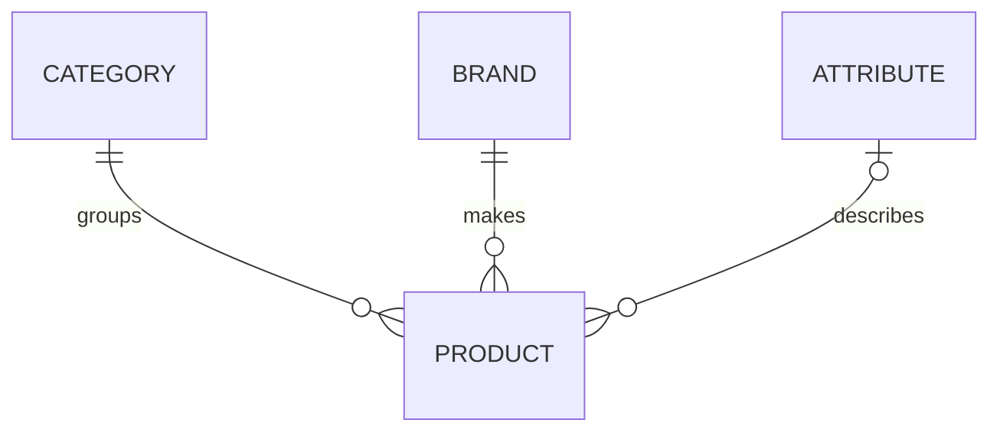

# POS System

A full-stack point-of-sale (POS) system for managing a store's product catalog and staff accounts. Sales and customer orders will be added as the project grows.

The repository contains two apps:

- **`backend/`**: a REST API built with Express 5, Sequelize 6 and MySQL
- **`client/`**: a web front end built with React 19, Vite and Tailwind CSS

> **Status:** in active development. Catalog and user management work in the backend. In the client, the Product Menu page manages products, categories, brands and attributes.

## Features

### Catalog management

- **Categories** group products, for example Hot Coffee or Pastries.
- **Brands** record who makes or supplies a product.
- **Attributes** are name and value pairs that describe a variant, such as Size → Large or Milk → Oat Milk. Each pair can exist only once.
- **Products** have a name, SKU, optional barcode, description, selling price, cost and stock quantity. Each product belongs to one category and one brand and can have one attribute. When a product is returned, its category, brand and attribute names come with it.

### User management

- Staff accounts have one of three roles: **admin**, **supervisor** or **staff**.
- Passwords are hashed with bcrypt before they are saved, and they are never sent back in a response.
- Usernames and emails must be unique, and emails must be in a valid format.

### Product Menu (client)

One page with a tab each for the product catalog, categories, brands and attributes. Every tab has:

- Stat cards, such as total products, units in stock, stock value and items that need restocking. A switch hides them.
- Filter chips with counts. Products are filtered by stock level (In Stock, Low Stock, Out of Stock) or by Inactive; the other tabs by Active and Inactive.
- A search box in the top bar that filters the open tab.
- A table with sortable columns, pagination and a "⋯" menu on each row for Edit, Set Active or Set Inactive, and Delete.
- Row selection, to set many records active or inactive, or delete them, at once.
- Add and edit forms that check the input before saving and point to the field that needs fixing.
- Deletes that are blocked because a record is still in use offer to deactivate it instead.
- Export to a CSV file of the rows that match the current search and filter.

### Data integrity

- Every create and update is checked before it reaches the database. Each problem gets a clear error message.
- Updates are partial, so only the fields you send are changed.
- Duplicate names, SKUs, barcodes, usernames and emails are rejected.
- A record that other records still use, such as a brand that products belong to, cannot be deleted. Set it to inactive instead.
- Each resource accepts only its own fields from a request and ignores everything else.
- Prices and costs come back as numbers, not strings.

## Tech stack

| Layer          | Technology                                            |
| -------------- | ----------------------------------------------------- |
| API            | Node.js, Express 5                                    |
| Database & ORM | MySQL, Sequelize 6, mysql2 driver                     |
| Security       | bcryptjs (password hashing), dotenv (configuration)   |
| Front end      | React 19, React Router 7, Axios                       |
| Styling        | Tailwind CSS 4                                        |
| Tooling        | Vite, Oxlint, nodemon, module-alias                   |

## Project structure

```
pos_system/
├── backend/
│   ├── index.js            # Entry point: sets up Express, registers routes, connects to the database
│   ├── package.json        # Dependencies, scripts and module aliases
│   ├── jsconfig.json       # Path aliases for editor autocompletion
│   └── src/
│       ├── config/         # Database connection
│       ├── models/         # Sequelize models and the relationships between them
│       ├── controllers/    # Validation and request handling for each resource
│       └── routers/        # Route registration for each resource
│
└── client/
    ├── index.html
    ├── vite.config.js      # React and Tailwind plugins, "@" import alias, dev proxy to the API
    ├── .env.example        # Environment variables the client reads
    └── src/
        ├── main.jsx        # React entry point: router and toast notifications
        ├── App.jsx         # Routes
        ├── index.css       # Tailwind and the brand tokens (colors, font)
        ├── api/            # One API module per resource
        ├── components/
        │   ├── layout/     # App shell: sidebar, top bar, page header
        │   └── ui/         # Reusable components built from the brand guideline
        ├── features/
        │   ├── records/        # Shared list screen: table, filters, stats, forms, dialogs
        │   └── product/        # The Product Menu's tabs, one folder each
        │       ├── prd_master/ # Product Catalog tab
        │       ├── category/   # Categories tab
        │       ├── brand/      # Brands tab
        │       └── attribute/  # Attributes tab
        ├── hooks/          # Shared hooks
        ├── lib/            # HTTP client, formatting and CSV helpers
        └── pages/          # One component per route
```

Every backend resource (category, brand, attribute, product and user) has its own model, controller and router. In the client, all record types share one list screen. Each tab folder holds a config file that describes the record type, and a `pages/` folder with the tab component, for example `product/category/categoryConfig.jsx` and `product/category/pages/Category.jsx`.

## Data model



A product must have one category and one brand, and can have one attribute. Users are stored on their own and can be linked to a store.

## Getting started

### Prerequisites

- [Node.js](https://nodejs.org/) 20.19 or later (22 LTS recommended)
- MySQL 8 or MariaDB, for example through XAMPP
- nodemon, installed globally:

  ```bash
  npm install -g nodemon
  ```

### 1. Clone the repository

```bash
git clone <your-repo-url>
cd pos_system
```

### 2. Set up the database

Create a database and the tables for categories, brands, attributes, products and users. The server connects to the database when it starts, but it does **not** create or update tables.

> Create every table with `ENGINE=InnoDB`. Some MySQL and MariaDB setups, including XAMPP, use MyISAM by default. MyISAM ignores foreign keys without any warning, so records that are still in use could be deleted.

### 3. Configure the backend

Create a `backend/.env` file and fill in your own connection details:

```env
DATABASE_HOST=
DATABASE_PORT=
DATABASE_NAME=
DATABASE_USERNAME=
DATABASE_PASSWORD=
```

`.env` files are git-ignored in both apps. Never commit real credentials.

### 4. Start the backend

```bash
cd backend
npm install
npm start
```

The console shows whether the database connection worked and the address the server is listening on.

### 5. Configure the client

During development, the Vite dev server forwards API requests to the backend. The browser then only talks to one origin, so the backend doesn't need CORS.

Create `client/.env.development` and set `API_PROXY_TARGET` to the backend's address. [`client/.env.example`](client/.env.example) lists every variable the client reads.

Vite loads `client/.env`, plus `.env.development` or `.env.production` depending on the mode. Only variables that start with `VITE_` reach the browser code. Anyone using the app can read them, so never put secrets in them. `API_PROXY_TARGET` has no `VITE_` prefix, so it stays on the dev server.

### 6. Start the client

In a second terminal:

```bash
cd client
npm install
npm run dev
```

Vite prints the local address to open in your browser.

## Scripts

| Folder    | Command           | What it does                                          |
| --------- | ----------------- | ----------------------------------------------------- |
| `backend` | `npm start`       | Starts the API with nodemon, which restarts it when a file changes |
| `client`  | `npm run dev`     | Starts the Vite dev server with hot reload            |
| `client`  | `npm run build`   | Builds the production bundle into `client/dist`       |
| `client`  | `npm run preview` | Serves the production build locally                   |
| `client`  | `npm run lint`    | Lints the code with Oxlint                            |

## Backend conventions

- **Path aliases:** import with `@config`, `@models`, `@controllers` and `@helper` instead of long relative paths like `../../`. The aliases are defined in `_moduleAliases` in `backend/package.json`, which module-alias reads at runtime. They are repeated in `backend/jsconfig.json` so the editor can autocomplete them, so add any new alias in both files.
- **Response shape:** a successful response returns `{ "data": ... }`. A response with only a message, including every error, returns `{ "message": "..." }`.
- **Status codes:**
  - `400`: invalid input
  - `404`: record not found
  - `409`: duplicate value, or the record is still in use
  - `500`: unexpected error
- **Deactivate instead of delete:** every resource has an `active` flag. To retire a record, set `active` to `false` rather than deleting it.

### Adding a new resource

1. Create a model in `src/models/` and export it from `src/models/index.js`. Define its relationships to other models in that file too.
2. Create a controller in `src/controllers/` with the validation and request handlers.
3. Create a router in `src/routers/`.
4. Register the router in `index.js`.

## Client conventions

- **Brand tokens:** colors and the font are defined once in `client/src/index.css` and used as Tailwind classes, such as `bg-brand`, `text-ink` and `border-line`. Use these rather than raw hex values. Spacing follows the 8px grid, so prefer even steps like `2`, `4`, `6` and `8`.
- **Imports:** use the `@/` alias for anything in `src`, for example `@/components/ui/Button`.
- **UI components:** build screens from `src/components/ui`: buttons, fields, tabs, menus, modals, tables, pagination, stat cards and toasts. Add a component there when two screens need the same pattern.
- **Record screens:** `RecordPanel` in `src/features/records` handles everything a list tab does, such as loading, search, filters, sorting, paging, selection, export and the add, edit and delete dialogs. Each record type only supplies a config. [`categoryConfig.jsx`](client/src/features/product/category/categoryConfig.jsx) is a short example, and [`productConfig.jsx`](client/src/features/product/prd_master/productConfig.jsx) shows selects that pick from other lists.
- **Server errors:** read them with `getErrorMessage` and `getErrorStatus` from `@/lib/http`. Those helpers already turn the backend's `{ "message": "..." }` responses and network failures into text a user can understand.

### Adding a record type to the client

1. Add its API module in `src/api/catalog.js` with `createRecordApi`.
2. Create a folder for it, such as `src/features/product/<name>/`, with a config file for its columns, filter chips, stats, CSV columns and form fields. The field types are listed at the top of `src/features/records/formFields.js`.
3. Add a tab component in that folder's `pages/` folder that renders `<RecordPanel config={...} />`.
4. Add the tab to `TABS` in `src/pages/ProductMenuPage.jsx`.

## Roadmap

- [x] Category, brand, attribute and product management
- [x] User management with hashed passwords
- [x] Product Menu page: Product Catalog, Categories, Brands and Attributes tabs
- [ ] Login and role-based access control (admin, supervisor, staff)
- [ ] Production setup: serve the client and API from one origin, or enable CORS
- [ ] Sales checkout and receipts
- [ ] Customer orders
- [ ] Support for multiple stores
- [ ] Client screens: checkout and user admin
- [ ] Database migrations and seed data

## Troubleshooting

| Problem | Fix |
| ------- | --- |
| `database connection failed` on start-up | Make sure MySQL is running and check the values in `backend/.env`. The server still starts, but every request that needs the database will fail. |
| `nodemon` is not recognized | Install it globally with `npm install -g nodemon`, or run `npx nodemon index.js`. |
| `Cannot find module '@models'` (or another alias) | Keep `require("module-alias/register")` as the first line of `backend/index.js`, and make sure the alias exists in `backend/package.json`. |
| A record that is still in use can be deleted | The tables were probably created as MyISAM. Recreate them with `ENGINE=InnoDB` and their foreign keys. |
